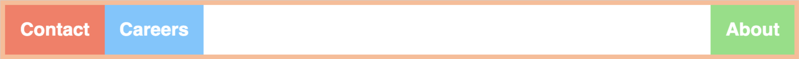
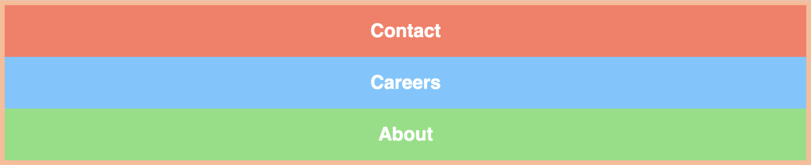
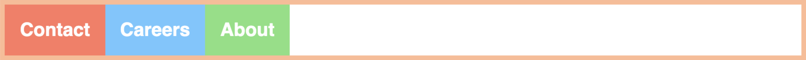

# Prep Course Checkpoint
El challenge de hoy consiste en tres partes:

    * teoría
    * práctica (js)
    * práctica (html y css)


## Teoría

En la parte teórica vas a tener que explicar *con tus propias palabras* los conceptos que te pedimos. Las consignas y respuestas estarán en `teoria.md`

## JavaScript

En la parte práctica, te vamos a brindar los tests preparados, tu tarea es completar el código en `checkpoint.js` de tal forma que pasen la mayoría de los tests. Para ejecutar los tests, primero debes tirar el comando `npm install` dentro de esta carpeta.
Luego, en esta misma carpeta usas `npm test`.

## HTML y CSS

## Ejercicio 1

Crear un documento HTML completo, que deberá tener los siguentes elementos:

    * un div que contenga todo lo demás.
    * una lista desordenada con tres elementos con texto.
    * una imagen.
    * un párrafo que contenga dos spans.
    * un link a una página de tu elección.

Debes crear una hoja de estilos **externa** llamada `styles.css` y dentro escribir las reglas necesarias tal que:

    * el div contenedor ocupe el 75% del tamaño de la pantalla y esté centrado.
    * Los elementos de la lista deben tener un tamaño de letra de 25px y ser de color rojo.
    * la imagen debe estar centrada.
    * el color del link no debe ser violeta una vez que se haya clickeado.

## Ejercicio 2

En este ejercicio vas a crear un documento HTML que contenga:

* un div de color negro, que esté centrado y tengas las siguientes propiedades:
    - un margin de 30 px arriba y abajo.
    - un borde superior de 1px, el inferior de 30px, el izquierdo de 1 px y el derecho de 20px, todos de color negro y estilo `solid`
    - padding de 10px arriba y abajo, y 5px izquierda y derecha.
    - el div debe tener un tamaño definido, podés elegir cualquier tamaño.
* Usando `flex` y usando esté código html:
    ```html
        <div class="navbar">
          <div>Contact</div>
          <div>Careers</div>
          <div>About</div>
        </div>
    ```
    Debes crear los siguientes layouts (copiar y pegar el código de arriba por cada layout, deben estar todos en el HTML):

    - 
    - 
    - 

    Finalmente, usar tus conocimientos de position, para dejar el primero de la lista que quede siempre fijo en la parte inferior de la pantalla.

## Subir tu checkpoint

Una vez terminado el checkpoint, debes crear un repositorio nuevo en tu cuenta de github llamado: `PrepCheckpoint`. Y debes subir ahi tu checkpoint resuelto.

**Notas**:
* Sólo podés consultar a los PM y al instructor por problemas de instrucciones o si no te funcionan los tests.
* Hay cosas que tal vez no vimos específicamente en los lectures, vas a tener que investigar un poquito por tu cuenta.
* Tenes que subir el resultado del challenge antes de las 18:00 PM.
* Podés buscar en internet o en cualquier otro lugar por recursos para que te ayudes.
* No podés ayudar ni preguntar a tus compañeros de clases.